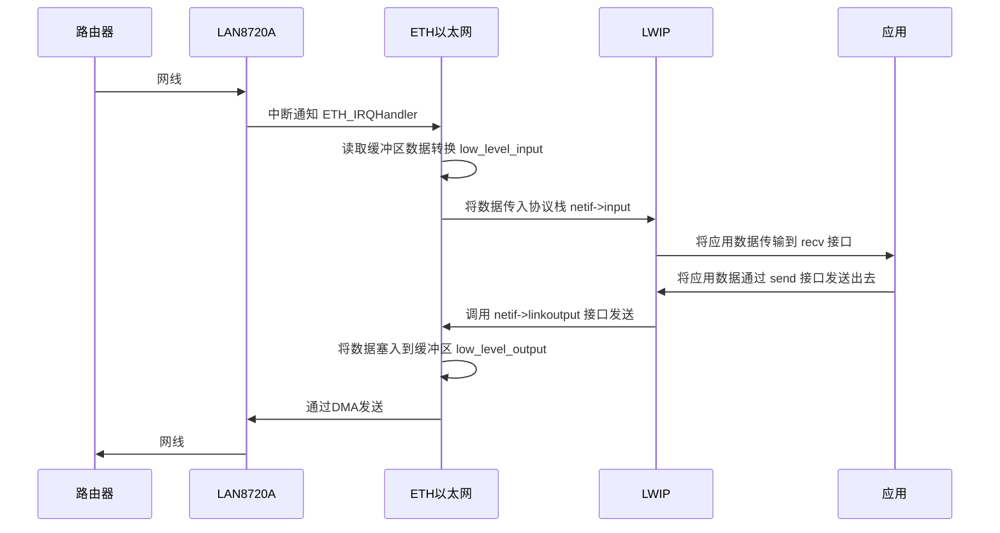

# stm32f4+FreeRTOS移植lwip2.1.2

---

**本篇目标：[上一篇freertos的优化(stm32f4_os_app)](https://blog.csdn.net/q361750389/article/details/106902407)中，RTOS的移植已经告一段落了，接下来就是移植重要的网络协议栈-lwip2.1.2！**

硬件配置：STM32_ETH以太网 + lan8720芯片

资料准备：

- lwip源码：[源码下载链接](http://download.savannah.nongnu.org/releases/lwip/)
- 最后工程：[项目工程(github分支)](https://github.com/jinhaotutu/stm32f4-prj/tree/stm32_lwip) project 文件夹下的 stm32_lwip 工程。

---

## 工程说明与已实现功能

工程借鉴了官网stm32移植lwip例程的接口文件，并升级在freertos10.3.1上移植lwip2.1.2版本。

已经实现的一些功能：

1. 实现了基于os的lwip，可以使用标准socket进行网络开发
2. dhcp自动获取ip
3. 网络接口热拔插
4. 接口封装，一键配置初始化
5. 可以直接打开目录下keil工程或者stm32cubeide工程进行烧写测试
6. 每个开源库与应用基本解耦，二次移植方便

---

## 源码lwip目录说明

为了方便，直接将工程下 thirdlib/lwip-2.1.2 目录拿来说明，相比源码增加了一个 port 文件夹（如有需要，可以直接copy该目录到自己的工程进行适配）：

```c
├─doc							// 文档说明
├─port							// 移植适配目录（源码目录不包括）
│  ├─arch							// type字定义
│  ├─driver							// 硬件适配
│  │  ├─sdio_wifi					// sdio wifi芯片（rtl8189待适配）
│  │  └─stm32_eth					// eth + lan8720
│  └─os								// RTOS接口封装
├─src							// lwip源码
│  ├─api						// 应用调用api接口
│  ├─apps						// 基于lwip的应用示例
│  ├─core						// 内部核心代码
│  ├─include					// 头文件
│  └─netif						// 数据格式
└─test							// 接口测试
```

---

## 适配文件接口说明

lwip的主要适配文件都集中在port文件夹，其中arch与os文件夹都是一些基础定义，以及freertos在lwip中的接口封装，不做详细说明，从接口名称比较容易就能看出函数的作用。

主要说明下stm32_eth文件夹下的代码，是主要硬件与lwip数据传输的部分。

```c
└─stm32_eth
      ├─ethernetif.c		// eth硬件与lwip数据交互接口
      ├─ethernetif.h
      ├─eth_init.c			// eth硬件初始化，接口函数
      ├─eth_init.h
      ├─lwip_init.c			// lwip初始化,建立任务等
      ├─lwip_init.h
      ├─stm32f4x7_eth.c		// stm32 eth外设库函数
      └─stm32f4x7_eth.h
```


eth_init.c (eth部分解析)：

```c
/* Ethernet pins configuration ************* lan8720硬件pin脚连接 *********/
    /*
        ETH_MDIO -------------------------> PA2
        ETH_MDC --------------------------> PC1
        ETH_MII_RX_CLK/ETH_RMII_REF_CLK---> PA1
        ETH_MII_RX_DV/ETH_RMII_CRS_DV ----> PA7
        ETH_MII_RXD0/ETH_RMII_RXD0 -------> PC4
        ETH_MII_RXD1/ETH_RMII_RXD1 -------> PC5
        ETH_MII_TX_EN/ETH_RMII_TX_EN -----> PB11
        ETH_MII_TXD0/ETH_RMII_TXD0 -------> PB12
        ETH_MII_TXD1/ETH_RMII_TXD1 -------> PB13
        ETH_MII_RESET/ETH_RMII_RESET -----> PC0
                                                  */

/**
 * eth以太网总初始化函数，初始化成功即与lan8720通讯成功
 */
uint32_t ETH_BSP_Config(void)
{
    uint32_t EthStatus = 0;

    /* Configure the GPIO ports for ethernet pins; lan8720引脚初始化配置，引脚连接如上 */
    ETH_GPIO_Config();

    /* Configure the Ethernet MAC/DMA; ETH调用stm32库函数初始化，与lan8720通讯 */
    EthStatus |= ETH_MACDMA_Config();

    /* Get Ethernet link status; 读取lan8720状态寄存器，自动协商完成 */
    if(ETH_ReadPHYRegister(PHY_ADDRESS, PHY_SR) & PHY_DUPLEX_STATUS)
    {
        EthStatus |= ETH_LINK_FLAG;
    }

    return EthStatus;
}

// 移植适配注意点：
1. 不同的芯片PHY地址或许不同，同样状寄存器的地址也不同，需要根据数据手册来确认，配置宏：PHY_ADDRESS、PHY_SR
2. 根据不同的硬件和芯片，重启、配置、协商的延迟时间都不同，需要进行调试：PHY_RESET_DELAY、PHY_CONFIG_DELAY、ETH_REG_WRITE_DELAY
3. 这里ETH底层调用的是STM32_ETH库函数，首先先要保证ETH正确的配置，能够读取到PHY芯片的寄存器信息
```


ethernetif.c (接口解析)：

```c
/**
 * 初始化函数，在lwip初始化的时候传入，在lwip内部调用
 */
err_t ethernetif_init(struct netif *netif)
{
    LWIP_ASSERT("netif != NULL", (netif != NULL));

    /* Initialize interface hostname */
    netif->hostname = "stm32_net";

    netif->name[0] = IFNAME0;
    netif->name[1] = IFNAME1;
    /* We directly use etharp_output() here to save a function call.
    * You can instead declare your own function an call etharp_output()
    * from it if you have to do some checks before sending (e.g. if link
    * is available...) */
    netif->output = etharp_output;
    netif->linkoutput = low_level_output;	// 与硬件交互的接口函数-输出

    /* initialize the hardware */
    low_level_init(netif);

    /* 定时更新arp信息 */
    etharp_init();
    sys_timeout(ARP_TMR_INTERVAL, arp_timer, NULL);

    return ERR_OK;
}

/**
 * 硬件初始化使能函数，在lwip初始化的时候被调用
 */
static void low_level_init(struct netif *netif)
{
    int i;

  /* set MAC hardware address length */
    netif->hwaddr_len = ETHARP_HWADDR_LEN;

    /* set MAC hardware address */
    netif->hwaddr[0] =  0;
    netif->hwaddr[1] =  1;
    netif->hwaddr[2] =  2;
    netif->hwaddr[3] =  3;
    netif->hwaddr[4] =  4;
    netif->hwaddr[5] =  5;

    /* initialize MAC address in ethernet MAC */
    ETH_MACAddressConfig(ETH_MAC_Address0, netif->hwaddr);

    /* maximum transfer unit */
    netif->mtu = 1500;

    /* device capabilities */
    /* don't set NETIF_FLAG_ETHARP if this device is not an ethernet one */
    netif->flags = NETIF_FLAG_BROADCAST | NETIF_FLAG_ETHARP | NETIF_FLAG_LINK_UP;

    /* Initialize Tx Descriptors list: Chain Mode */
    ETH_DMATxDescChainInit(DMATxDscrTab, &Tx_Buff[0][0], ETH_TXBUFNB);
    /* Initialize Rx Descriptors list: Chain Mode  */
    ETH_DMARxDescChainInit(DMARxDscrTab, &Rx_Buff[0][0], ETH_RXBUFNB);

  /* Enable Ethernet Rx interrrupt */
    for(i=0; i<ETH_RXBUFNB; i++)
    {
        ETH_DMARxDescReceiveITConfig(&DMARxDscrTab[i], ENABLE);
    }

    /* Enable the TCP, UDP and ICMP checksum insertion for the Tx frames */
    for(i=0; i<ETH_TXBUFNB; i++)
    {
        ETH_DMATxDescChecksumInsertionConfig(&DMATxDscrTab[i], ETH_DMATxDesc_ChecksumTCPUDPICMPFull);
    }

    /* Note: TCP, UDP, ICMP checksum checking for received frame are enabled in DMA config */
    sys_sem_new(&eth_input_sem, 0);
    sys_thread_new("eth_input_thread", eth_input_thread, NULL, 1024*2, (configMAX_PRIORITIES - 1));

    /* Enable MAC and DMA transmission and reception */
    ETH_Start();
}

/**
 * lwip输入函数，在线程中等待中断消息，并且读取数据
 */
err_t ethernetif_input(struct netif *netif)
{
    err_t err;
    struct pbuf *p;

    /* move received packet into a new pbuf */
    p = low_level_input(netif);

    /* no packet could be read, silently ignore this */
    if (p == NULL) return ERR_MEM;

    /* entry point to the LwIP stack */
    err = netif->input(p, netif);	// 将数据传入lwip

    if (err != ERR_OK)
    {
        LWIP_DEBUGF(NETIF_DEBUG, ("ethernetif_input: IP input error\n"));
        pbuf_free(p);
    }
    return err;
} 

/**
 * 数据转换，将lwip数据包组合塞入ETH buffer中发送出去
 */
static err_t low_level_output(struct netif *netif, struct pbuf *p)
/**
 * 与上函数相反，将ETH buffer中的数据读取出来，组成pbuf包传入lwip
 */
static struct pbuf * low_level_input(struct netif *netif)
```

lwip_init.c (接口解析)：

```c
/**
 * lwip初始化、检测任务
 */
static void LwIP_loop_task(void *p)
{
    uint32_t EthStatus = 0;

    ip_addr_t ipaddr={0};
    ip_addr_t netmask={0};
    ip_addr_t gw={0};

    /* eth init */
    net_status = NET_STATUS_CONFIG;

    EthStatus = ETH_BSP_Config();
    __log_debug("EthStatus:0x%02x", EthStatus);

    tcpip_init(NULL, NULL);

    /* - netif_add(struct netif *netif, struct ip_addr *ipaddr,
    struct ip_addr *netmask, struct ip_addr *gw,
    void *state, err_t (* init)(struct netif *netif),
    err_t (* input)(struct pbuf *p, struct netif *netif))

    Adds your network interface to the netif_list. Allocate a struct
    netif and pass a pointer to this structure as the first argument.
    Give pointers to cleared ip_addr structures when using DHCP,
    or fill them with sane numbers otherwise. The state pointer may be NULL.

    The init function pointer must point to a initialization function for
    your ethernet netif interface. The following code illustrates it's use.*/
    netif_add(&gnetif, &ipaddr, &netmask, &gw, NULL, ethernetif_init, tcpip_input);

    /*  Registers the default network interface.*/
    netif_set_default(&gnetif);

    if (EthStatus == (ETH_INIT_FLAG | ETH_LINK_FLAG))
    {
        net_status = NET_STATUS_LINK_UP;
        __log_debug("netif_set_up");
        /* Set Ethernet link flag */
        gnetif.flags |= NETIF_FLAG_LINK_UP;

        /* When the netif is fully configured this function must be called.*/
        netif_set_up(&gnetif);

        sys_thread_new("dhcp", LwIP_DHCP_task, NULL, 1024, (configMAX_PRIORITIES - 3));
    }
    else
    {
        net_status = NET_STATUS_LINK_DOWN;
        /*  When the netif link is down this function must be called.*/
        netif_set_down(&gnetif);
    }

    /* Set the link callback function, this function is called on change of link status*/
    netif_set_link_callback(&gnetif, ETH_link_callback);

    uint8_t flag = 0;
    while(1)
    {
        /* 循环检测网线通断 */
        if(ETH_Get_Link_Status())
        {
            flag = 1;
            network_led_write(&flag, 1);
            netif_set_link_up(&gnetif);
        }
        else
        {
            flag = 0;
            network_led_write(&flag, 1);
            netif_set_link_down(&gnetif);
        }

        sys_delay(100);
    }
}

/**
 * DHCP任务
 */
static void LwIP_DHCP_task(void *p)
{
    ip_addr_t ipaddr;
    ip_addr_t netmask;
    ip_addr_t gw;
    struct dhcp* dhcp;

    uint16_t timeout = 0;

    DHCP_STA dhcp_status = DHCP_START;

    while(1)
    {
        switch (dhcp_status)
        {
            case DHCP_START:
                net_status = NET_STATUS_DHCPING;
                __log_info("start dhcp ... ");
                dhcp_start(&gnetif);
                dhcp = netif_dhcp_data(&gnetif);
                /* IP address should be set to 0
                every time we want to assign a new DHCP address */
                dhcp_status = DHCP_WAIT_ADDRESS;

                break;

            case DHCP_WAIT_ADDRESS:
                /* Read the new IP address */
                if (dhcp->offered_ip_addr.addr != 0)
                {
                    dhcp_status = DHCP_ADDRESS_ASSIGNED;

                    __log_info("got dhcp ip");
                    ipaddr = dhcp->offered_ip_addr;
                    netmask = dhcp->offered_sn_mask;
                    gw = dhcp->offered_gw_addr;

                    /* Stop DHCP */
                    dhcp_stop(&gnetif);

                    __log_info("got ipadder: %s", inet_ntoa(ipaddr.addr));
                    __log_info("got netmask: %s", inet_ntoa(netmask.addr));
                    __log_info("got gwadder: %s", inet_ntoa(gw.addr));
                    netif_set_addr(&gnetif, &ipaddr , &netmask, &gw);

                    net_status = NET_STATUS_GOT_IP;

                    vTaskDelete(NULL);
                }
                else
                {
                    /* DHCP timeout */
                    if (timeout > 10)
                    {
                        dhcp_status = DHCP_TIMEOUT;

                        /* Stop DHCP */
                        dhcp_stop(&gnetif);

                        /* Static address used */
                        IP4_ADDR(&ipaddr, 192, 168, 100, 88);
                        IP4_ADDR(&netmask, 255, 255, 255, 0);
                        IP4_ADDR(&gw, 192, 168, 100, 1);
                        netif_set_addr(&gnetif, &ipaddr , &netmask, &gw);

                        __log_info("use static ip");
                        __log_info("got ipadder: %s", inet_ntoa(gnetif.ip_addr.addr));
                        __log_info("got netmask: %s", inet_ntoa(gnetif.netmask.addr));
                        __log_info("got gwadder: %s", inet_ntoa(gnetif.gw.addr));

                        net_status = NET_STATUS_GOT_IP;

                        vTaskDelete(NULL);
                    }
                    else
                    {
                        timeout++;
                    }
                }

                break;

            default:
                break;
        }

        /* wait 250 ms */
        sys_delay(250);
    }
}
```

---

## lwip适配数据通路解析



---

## 功能简单应用

在 project 文件下建立了 stm32f4_os_lwip 工程，在工程中简单调用 NetWork_Init() 就可以完成lwip的初始化，烧录后就可以 ping 通。


### 小结

将lwip协议栈的移植分为三个部分：

1. lwip协议栈初始化，包括协议初始化，dhcp等 -- lwip_init.c
2. lwip与硬件数据转换 -- ethernetif.c
3. 硬件初始化，数据接收 -- eth_init.c

如果需要重新移植其他硬件，只需要将硬件初始化的部分替换成自己的硬件驱动，再将格式装换成lwip的格式传入即可，上层保持不变。

---

如有其它问题可以问我哦~

 

Tuu